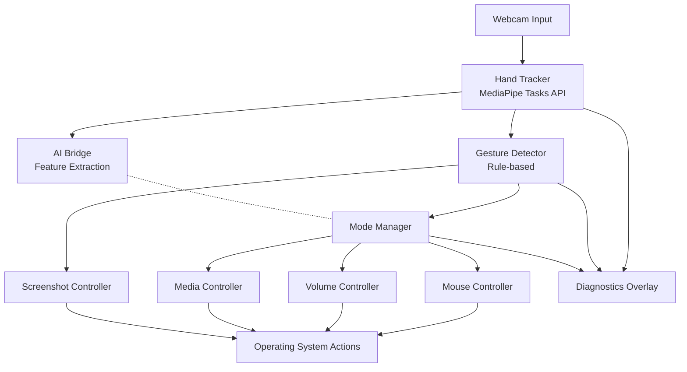
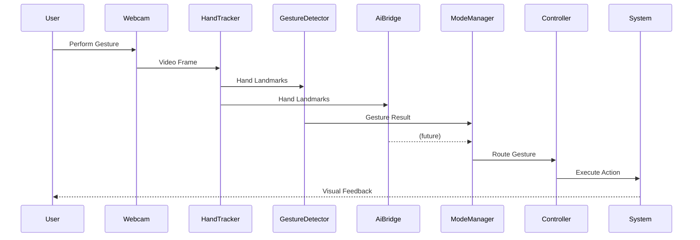

# GestureOS

Real-time AI-powered touchless computer control using MediaPipe, OpenCV, and gesture recognition.

GestureOS is a computer vision project that transforms hand gestures into computer actions using a webcam. It combines real-time hand tracking, gesture recognition, mode-based controls, and system automation to create a touchless human-computer interaction experience.

Features include:

* Mouse Control
* Volume Control
* Media Control
* Screenshot Capture
* Modular Mode System
* Real-Time Gesture Recognition
* Performance Diagnostics

---

## Why GestureOS?

GestureOS is more than a virtual mouse project.

The system is built using a modular architecture that separates hand tracking, gesture recognition, mode management, and controller logic. This design allows new interaction modes and gesture-based workflows to be added without major refactoring.

Key engineering goals:

* Modular architecture
* Real-time performance
* Reliable gesture recognition
* Extensible mode system
* Professional software engineering practices
* Future AI integration

---

## Features

### Computer Vision

* Real-time webcam hand tracking
* MediaPipe Tasks API hand landmark detection
* Single-hand gesture recognition
* Landmark visualization
* Gesture confidence tracking

### Mouse Control

* Cursor movement using index finger
* Left click using thumb-index pinch
* Right click using thumb-middle pinch
* Smooth scrolling
* Cursor stabilization and click locking

### Productivity Controls

* System volume control
* Media playback controls
* Screenshot capture
* Mode switching

### User Experience

* Real-time FPS display
* Detection confidence display
* Current gesture display
* Current mode display
* Status overlays
* Gesture cooldown system
* State locking system

### Safety Features

* Closed-fist exit gesture
* Keyboard exit (`Q`)
* Mode transition protection
* Cooldown-based gesture filtering

---

## Architecture Diagram



---

## Runtime Flow



---

## Demo

### GestureOS Interface

(Add application screenshot here)

### Gesture Controls

(Add demonstration GIF here)

### Mode Switching

(Add mode switching GIF here)

---

## Tech Stack

| Technology          | Purpose                                       |
| ------------------- | --------------------------------------------- |
| Python 3.14.3       | Core application runtime                      |
| OpenCV              | Webcam capture and rendering                  |
| MediaPipe Tasks API | Hand tracking and landmark detection          |
| PyAutoGUI           | Mouse, scrolling, screenshots, media controls |
| NumPy               | Numerical operations                          |
| PyCAW               | Windows volume control                        |
| comtypes            | Windows COM support                           |

---

## Controls

Detailed documentation is available in `CONTROLS.md`.

### Mouse Mode

| Gesture                   | Action                |
| ------------------------- | --------------------- |
| Index Finger Movement     | Move Cursor           |
| Thumb + Index Pinch       | Left Click            |
| Thumb + Middle Pinch      | Right Click           |
| Two-Finger Scroll Gesture | Scroll                |
| Open Hand (Hold 2s)       | Switch to Volume Mode |
| Peace Sign (Hold 2s)      | Switch to Media Mode  |

### Volume Mode

| Gesture                | Action               |
| ---------------------- | -------------------- |
| Thumb ↔ Index Distance | Adjust Volume        |
| Open Hand (Hold 2s)    | Return to Mouse Mode |

### Media Mode

| Gesture              | Action               |
| -------------------- | -------------------- |
| Open Palm            | Play / Pause         |
| Swipe Right          | Next Track           |
| Swipe Left           | Previous Track       |
| Peace Sign (Hold 2s) | Return to Mouse Mode |

### Global Controls

| Gesture               | Action           |
| --------------------- | ---------------- |
| Closed Fist (Hold 2s) | Exit Application |
| Three-Finger Pinch    | Take Screenshot  |
| Q Key                 | Exit Application |

---

## Installation

### 1. Clone Repository

```bash
git clone https://github.com/yourusername/GestureOS.git
cd GestureOS
```

### 2. Create Virtual Environment

```powershell
python -m venv .venv
.\.venv\Scripts\Activate.ps1
```

### 3. Install Dependencies

```powershell
pip install -r requirements.txt
```

### 4. Download MediaPipe Model

Download:

```text
hand_landmarker.task
```

Place it inside:

```text
assets/models/hand_landmarker.task
```

Official MediaPipe model:

```text
https://storage.googleapis.com/mediapipe-models/hand_landmarker/hand_landmarker/float16/1/hand_landmarker.task
```

### 5. Run GestureOS

```powershell
python main.py
```

---

## Project Structure

```text
GestureOS/
│
├── AGENTS.md
├── README.md
├── CONTROLS.md
├── DEVELOPMENT_LOG.md
├── requirements.txt
│
├── configs/
│   ├── ai_config.py
│   └── constants.py
│
├── ai/
│   ├── __init__.py
│   ├── bridge.py
│   ├── features/
│   │   ├── __init__.py
│   │   └── extractor.py
│   └── data/
│       ├── __init__.py
│       ├── dataset_storage.py
│       ├── data_augmenter.py
│       └── gesture_recorder.py
│
├── tools/
│   ├── __init__.py
│   └── record_gestures.py
│
├── profiles/
│   ├── __init__.py
│   ├── profile_manager.py
│   └── profiles/
│       └── default.json
│
├── trackers/
│   └── hand_tracker.py
│
├── gestures/
│   └── gesture_detector.py
│
├── controllers/
│   ├── base_controller.py
│   ├── mouse_controller.py
│   ├── volume_controller.py
│   ├── media_controller.py
│   └── screenshot_controller.py
│
├── modes/
│   └── mode_manager.py
│
├── utils/
│   └── helpers.py
│
└── assets/
    ├── models/
    └── screenshots/
```

---

## Performance

GestureOS is optimized for responsiveness and real-time interaction.

Recommended resolutions:

| Resolution | Use Case         |
| ---------- | ---------------- |
| 640×480    | Best Performance |
| 960×540    | Balanced         |
| 1280×720   | Highest Quality  |

Performance can be tuned through:

* Cursor smoothing
* Dead zone filtering
* Scroll sensitivity
* Gesture thresholds
* Volume smoothing

All configuration values are centralized in:

```text
configs/constants.py
```

---

## System Architecture

Core modules:

### HandTracker

Responsible for:

* Webcam access
* MediaPipe initialization
* Landmark extraction
* Coordinate conversion
* Landmark rendering

### GestureDetector

Responsible for:

* Gesture recognition
* Hold tracking
* Swipe detection
* Pinch detection
* State management

### Controllers

Responsible for executing actions:

* MouseController
* VolumeController
* MediaController
* ScreenshotController

### ModeManager

Responsible for:

* Mode transitions
* Gesture routing
* Cooldowns
* State locking

### AiGestureBridge

Responsible for:

* Feature extraction (landmarks → feature vectors)
* Non-blocking integration with the main loop
* Caching latest feature vector for model inference

### ProfileManager

Responsible for:

* User profile loading and saving
* Sensitivity and mode preferences
* Default profile creation

### GestureOSApplication

Responsible for:

* Main loop
* Overlay rendering
* Lifecycle management
* Shutdown handling

---

## AI Foundation

GestureOS includes a modular AI subsystem that runs alongside the rule-based gesture detector. In the current phase, the AI pipeline performs feature extraction only — no model inference, no classification, and no behavioral changes.

### Architecture

The AI subsystem is designed for a future hybrid detection strategy:

- **Phase 1A (current):** Feature extraction engine + profile system + infrastructure. AI bridge runs silently in the background.
- **Phase 1B:** Data recording and dataset storage.
- **Phase 2:** Model training and evaluation.
- **Phase 3:** AI-assisted detection with diagnostic overlay.
- **Phase 4:** Full hybrid detection with user-selectable modes.

All AI components are optional. If no model exists, the application degrades gracefully to rule-based detection with no code changes.

### Feature Vector

The `FeatureExtractor` transforms 21 MediaPipe hand landmarks into a fixed-length 61-element vector organized into five groups:

| Group | Count | Description | Rationale |
|---|---|---|---|
| A — Wrist-relative x,y | 40 | Landmarks 1–20 offset from wrist, normalised by hand size | Eliminates absolute-position overfitting |
| B — Fingertip distances | 10 | All C(5,2) fingertip pairwise distances, normalised by hand size | Direct pinch/fist/open-hand signal |
| C — Extension deltas | 5 | tip.y − mcp.y per finger (continuous) | Most discriminative extension signal |
| D — Bend angle cosines | 5 | cos(θ) at PIP joint using 2D dot products | Rotation-resistant curl information |
| E — Hand size | 1 | Wrist-to-middle-MCP Euclidean distance | Context and normalisation reference |

The vector is designed to be invariant to hand size, camera distance, and screen resolution. z-coordinates are excluded due to camera-distance sensitivity. No features are redundant — each group provides independent signal.

---

## Dataset Infrastructure (Phase 2)

GestureOS includes a complete pipeline for recording, storing, and augmenting gesture datasets for future ML model training.

### Gesture Recorder

The recorder is a standalone tool that captures labeled hand-landmark feature vectors in real time:

```powershell
python -m tools.record_gestures
```

| Key | Action |
| --- | ------ |
| `0`–`9` | Select gesture-pose label (see below) |
| `SPACE` | Save current frame as a sample |
| `R` | Toggle continuous recording mode (auto-saves on hand detection) |
| `U` | Undo last save |
| `S` | Show dataset summary |
| `Q` | Quit |

**Gesture-pose labels** (describe hand shape, not action):

| Key | Gesture | Hand Shape Description | Training Set |
|-----|---------|-----------------------|--------------|
| `0` | `NO_HAND` | No hand detected / background | Initial |
| `1` | `POINTING` | Index finger extended, others curled | Initial |
| `2` | `PINCH_INDEX` | Thumb + index fingertip pinch | Initial |
| `3` | `PINCH_MIDDLE` | Thumb + middle fingertip pinch | Initial |
| `4` | `TWO_FINGER_UP` | Index + middle extended upward (scroll direction is rule-based) | Initial |
| `5` | `OPEN_HAND` | All fingers spread | Initial |
| `6` | `FIST` | All fingers curled | Initial |
| `7` | `THREE_FINGER_PINCH` | Thumb + index + middle tips together | Initial |
| `8` | `PINCH_PINKY` | Thumb + pinky fingertip pinch | Reserved |
| `9` | `PEACE` | Index + middle V-sign, ring+pinky curled | Initial |

**Training set**: 9 labels used for initial model training.
**Reserved**: `PINCH_PINKY` — recorded but excluded from initial training. Can be added after baseline is established.

Dynamic gestures (`SWIPE_RIGHT`, `SWIPE_LEFT`) are excluded from the static dataset — they require temporal/sequence-based modeling and are targeted for a future phase.

Each sample stores the 61-element feature vector, raw landmarks (21×3), session ID (auto-generated), profile ID (from ProfileManager), and timestamp.

### Dataset Storage

`DatasetStorage` manages labeled feature vectors on disk:

- `save_sample(label, features, landmarks, session_id, profile_id)` — Save a sample
- `load_samples(label)` — Load all samples for a label (validates FEATURE_COUNT)
- `load_landmarks(label)` — Load raw landmarks for re-extraction
- `load_all()` — Load every labeled sample
- `delete_sample(label, id)` / `delete_label(label)` — Remove data
- `export_csv(path)` / `export_json(path)` — Export for external tools
- `train_test_split(ratio)` — Split for model training

### Data Augmenter

`DataAugmenter` generates synthetic training variations from existing feature vectors:

| Transform | Description |
| --------- | ----------- |
| `add_jitter` | Gaussian noise (simulates tracking jitter) |
| `scale_variation` | Uniform random scale (simulates different hand sizes) |
| `feature_dropout` | Random zero-out (simulates partial occlusion) |
| `augment_single(vec, n)` | All three transforms combined for `n` variations |
| `augment_dataset(features, labels, n)` | Augment an entire dataset |

### Modules

- `configs/ai_config.py` — AI-specific settings (feature count, model paths, thresholds)
- `ai/features/extractor.py` — Feature extraction pipeline
- `ai/bridge.py` — Non-blocking bridge between main loop and AI subsystem
- `profiles/profile_manager.py` — User profile persistence (sensitivity, mode preferences)

---

## Future Roadmap

Planned future features:

* Presentation Mode
* Gaming Mode
* Air Drawing
* Custom Gesture Training
* Gesture Macros
* Gesture Analytics
* Multi-Hand Support
* User Profiles
* AI-Based Gesture Recognition

The current architecture is designed to support these additions without major refactoring.

---

## Troubleshooting

### Low FPS

* Use 640×480 resolution.
* Close other webcam applications.
* Improve room lighting.

### Cursor Feels Slow

Adjust:

```text
CURSOR_SMOOTHING_FACTOR
```

inside:

```text
configs/constants.py
```

### Volume Control Not Working

Ensure:

* Windows is being used.
* PyCAW is installed.
* COM permissions are available.

### Model File Missing

Verify:

```text
assets/models/hand_landmarker.task
```

exists before starting the application.

### Mode Switching Not Working

Hold the activation gesture continuously for 2 seconds.

A cooldown is applied between mode transitions.

---

## License

MIT License recommended.

A license file can be added before public release.